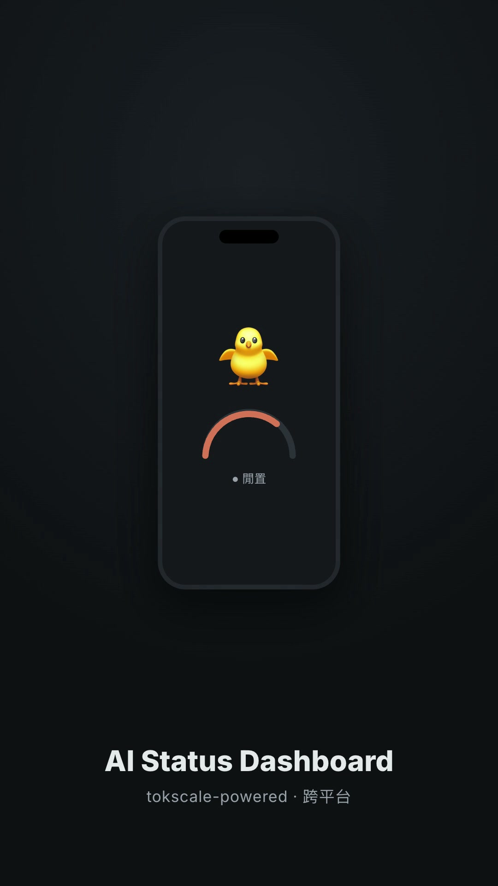

# AI Status Dashboard

> 本地常駐的迷你 web dashboard——把 **Claude Code**、**Codex**（未來可加 antigravity 等）的用量做成一頁，讓桌上閒置的 iPhone 用 Safari 連區網當「常駐副螢幕」看。資料源為跨平台的 [tokscale](https://github.com/junhoyeo/tokscale) CLI，除即時額度環外還提供日/週/月歷史報表、工具/模型佔比與使用熱力圖。附 [petdex](https://petdex.dev) 像素寵物：工作中會動、閒置會呼吸、額度用完會睡著。

## Demo · 宣傳短片

[](https://github.com/s813082/ai-status-dashboard/blob/main/brag-output/brag.mp4)

> 點上方封面 → 在 GitHub 內建播放器播放（約 60 秒，直式）。或直接內嵌播放（push 到 `main` 後於 GitHub 頁面自動顯示）：
>
> https://github.com/s813082/ai-status-dashboard/raw/main/brag-output/brag.mp4

- **純 `node:http` + 單一 vendored 圖表庫**：無 Express、無前端框架、除本地打包的 Chart.js 外無執行期相依套件。
- **多視圖單頁**：Launcher 首頁 + hash 路由切換「今日 / 用量報表 / 工具佔比 / 熱力圖 / 額度警示 / 設定」。
- **兩速資料流**：額度/花費每 60s 更新；運作狀態走前端 ~5s 輪詢即時更新（僅在今日/首頁時輪詢）。
- **雙語 i18n**：繁體中文 / English 即時切換。
- **全自動常駐**：launchd `RunAtLoad` + `KeepAlive`，開機自動起。

---

## 目錄

- [運作原理](#運作原理)（Explanation）
- [快速開始](#快速開始教學)（Tutorial）
- [How-to 指南](#how-to-指南)
  - [切換視圖](#切換視圖)
  - [自訂／切換寵物](#自訂切換寵物)
  - [修復 tokscale 抓不到某個 provider](#修復-tokscale-抓不到某個-provider)
  - [讓 iPhone 螢幕恆亮](#讓-iphone-螢幕恆亮)
  - [矮螢幕／橫向副螢幕自適應](#矮螢幕橫向副螢幕自適應)
  - [在 Windows 上使用](#在-windows-上使用)
- [參考](#參考)（Reference）
  - [HTTP API](#http-api)
  - [額度環對映規則](#額度環對映規則)
  - [專案結構](#專案結構)
  - [設定與連接埠](#設定與連接埠)
- [已知限制](#已知限制)
- [疑難排解](#疑難排解)
- [維護提醒](#維護提醒)
- [Changelog](#changelog)
- [授權與素材聲明](#授權與素材聲明)

---

## 運作原理

```
tokscale usage --json ───┐
tokscale codex status ───┼─ 60s ─▶ src/collectors/tokscaleSnapshot.js ─▶ data/snapshot.json（記憶體 + 落地）
tokscale graph -c <t> ───┘                                                       │
~/.claude/projects/**/*.jsonl                                                    ▼
~/.codex/sessions/**/*.jsonl  ── mtime ──▶ src/collectors/activity.js ─ 即時 ─▶ src/server.js (0.0.0.0:8787)
                                                                                 │
tokscale monthly / models / graph ── on-demand（TTL 快取）─▶ tokscaleReports.js ─▶ /api/usage/*
                                                                                 ▼
                            GET /api/status（5s 輪詢）+ 報表 API ◀── iPhone / 瀏覽器（多視圖）
```

本專案只負責「讀 tokscale → 正規化 → 判斷運作狀態 → 畫成多視圖頁面」，不自己碰各家帳號 OAuth：**授權由各 CLI 與 tokscale 的整合機制負責**（見[修復 tokscale 抓不到某個 provider](#修復-tokscale-抓不到某個-provider)）。

- **額度／花費（60s）**：`tokscaleSnapshot.js` 每 60 秒經 tokscale CLI 取得——Claude 額度來自 `tokscale usage --json`、Codex 額度來自 `tokscale codex status --json`、花費由 `tokscale graph -c <client> --today / --since` 的 `summary.totalCost` 推算。輸出正規化為 `providers.{claude,codex}` 的 `windows[]` 與 `cost`。
- **韌性**：整體抓取失敗 → 沿用上一份快取並標 `stale`；tokscale 對某 provider 額度**間歇性抓不到**時（尤其 Claude），`usage --json` 會重試數次，仍缺則 **carry-forward 沿用該 provider 上一份好資料**，避免額度環閃成空白。
- **運作狀態（即時）**：`activity.js` 只看檔案 mtime（不掃 process）。`~/.claude/projects` 或 `~/.codex/sessions` 底下 `.jsonl` 在 60 秒內有寫入 → `working`；額度觸底 → `exhausted`；其餘 → `idle`。每次 `/api/status` 請求即時計算。
- **報表（on-demand）**：`tokscaleReports.js` 對 daily/monthly/models/graph/custom 加 60–120 秒 TTL 記憶體快取並串行化同 key 請求，避免報表頁高頻 spawn tokscale。
- **前端**：單一自包含 `index.html`（inline CSS/JS、hash 路由）+ 本地 `i18n.js` + 本地 vendored `chart.umd.min.js`。今日視圖每 5 秒輪詢 `/api/status`；切到報表視圖會**暫停**該輪詢並改抓對應報表 API。

---

## 快速開始（教學）

### 需求

- macOS（Windows 見[在 Windows 上使用](#在-windows-上使用)）。
- 已安裝 [tokscale](https://github.com/junhoyeo/tokscale) CLI 並可於 PATH 執行（`command -v tokscale`）。
- 各 AI 工具已在本機登入，且 tokscale 能讀到其憑證：
  - **Codex**：`tokscale codex import`（從本機 `~/.codex` 憑證匯入為 tokscale 帳號）。
  - **Claude**：tokscale 直接讀本機 Claude Code 的登入狀態。
  - 驗證：`tokscale usage --json` 應能列出 Claude／Codex，`tokscale codex status --json` 不回 `error`。
- Node.js `>=18`（本專案以 nvm 安裝的 Node 測試；launchd 需要 node 的**絕對路徑**）。

### 1. 取得程式碼並確認可跑

```bash
git clone <your-repo-url> ai-status-dashboard
cd ai-status-dashboard
which node          # 記下絕對路徑，稍後填進 launchd plist
dirname "$(command -v tokscale)"   # 記下 tokscale 所在目錄，稍後填進 plist 的 PATH
```

> 本 repo **不內附寵物 sprite**（見[授權與素材聲明](#授權與素材聲明)），素材庫初始為空；先加至少一隻寵物再啟動較完整（見[自訂／切換寵物](#自訂切換寵物)），或先跳過、之後再從設定頁加。

### 2. 本機直接試跑

```bash
npm start                                        # node src/server.js（預設 port 8787）
curl -s http://localhost:8787/api/status | jq    # 應含 claude/codex + windows + activity
open http://localhost:8787                        # 瀏覽器開 Launcher 首頁
```

### 3. 佈署為 launchd 常駐服務

編輯 `launchd/com.barry.ai-status-dashboard.plist`，把 `/Users/YOUR_USERNAME/...` 換成實際絕對路徑，並特別確認 **`PATH` 與 `TOKSCALE_BIN`**（launchd 的 PATH 不含 nvm/homebrew，且 tokscale 是 node 腳本，缺 node 於 PATH 會噴 `env: node: No such file or directory`）：

```xml
<key>EnvironmentVariables</key>
<dict>
    <key>PORT</key><string>8787</string>
    <!-- 用 dirname "$(command -v tokscale)" 取得，含 node 所在的 nvm bin -->
    <key>PATH</key><string>/Users/YOUR_USERNAME/.nvm/versions/node/vXX/bin:/usr/local/bin:/usr/bin:/bin:/usr/sbin:/sbin</string>
    <key>TOKSCALE_BIN</key><string>/Users/YOUR_USERNAME/.nvm/versions/node/vXX/bin/tokscale</string>
</dict>
```

接著載入：

```bash
cp launchd/com.barry.ai-status-dashboard.plist ~/Library/LaunchAgents/
launchctl bootstrap gui/$(id -u) ~/Library/LaunchAgents/com.barry.ai-status-dashboard.plist
launchctl list | grep ai-status-dashboard        # 應在清單內
```

### 4. 用 iPhone 連線

- 首選 Bonjour/mDNS：iPhone Safari 開 **`http://YOUR-MAC.local:8787`**（主機名以 `scutil --get LocalHostName` 查）。
- mDNS 被關時改用當下 LAN IP：`http://<LAN-IP>:8787`（`ipconfig getifaddr en0`）。
- Safari「加入主畫面」→ 全螢幕 app（已含 `apple-mobile-web-app-capable` meta 與 apple-touch-icon）。

---

## How-to 指南

### 切換視圖

打開頁面先看到 **Launcher 首頁**，點磚進入各視圖；左上 **← 選單** 回首頁。

| 視圖 | Hash | 內容 |
| --- | --- | --- |
| 今日用量 | `#/today` | 兩欄即時額度環 + 寵物 + 花費（現有主畫面）|
| 用量報表 | `#/usage` | 期間下拉（本週／本月／自訂）→ **逐日、分工具的堆疊面積圖** |
| 工具佔比 | `#/pie` | 甜甜圈圖；「分組」可切**依工具**或**依模型** |
| 使用熱力圖 | `#/heatmap` | GitHub 綠格風格的年度貢獻圖（手刻 CSS grid）|
| 額度警示 | `#/alerts` | 目前接近上限的額度清單 |
| 設定 | `#/settings` | 語言 / 主題 / 更新頻率 / 顯示工具 / 螢幕恆亮 / 花費預算與警示閾值 / 寵物 |

### 自訂／切換寵物

**在網頁上切換**：進 **設定（`#/settings`）** 頁最下方，Claude／Codex 兩區各列出素材庫縮圖，點一下即切換。選擇存進 `data/pet-config.json`，重整後保留。

**把寵物加進素材庫**（三選一）：

1. **一鍵補貨（petdex 圖庫）**——先 `npx petdex list` 找 slug，再 `npm run add-pet <slug>`，會自動 `petdex install` 並複製進 `src/public/pets/library/<slug>/`。
2. **自己丟資料夾**——把一組 `spritesheet.webp` + `pet.json` 放進 `src/public/pets/library/<你的名字>/`；`pet.json` 至少要有：
   ```json
   { "id": "<你的名字>", "displayName": "顯示名", "spritesheetPath": "spritesheet.webp" }
   ```
3. **請他人代放**——把上述兩個檔交給協作者放進素材庫。

**素材格式**：spritesheet 為 **8 欄 × 9 列**、每格 **192×208px**（整張 1536×1872）；第 0 列 idle、第 2 列 working 動作幀（petdex 標準佈局）。

### 修復 tokscale 抓不到某個 provider

額度環顯示「無資料」或 `/api/status` 某 provider 帶 `error`，代表 **tokscale 抓不到該 provider 的訂閱額度**。這是 tokscale／上游的授權或間歇性問題，非 dashboard bug——**dashboard 不做登入頁**，修復點在 tokscale 端：

- **Codex 回 401 / 無資料**：重跑 `tokscale codex import`（前提是 Codex CLI 本機仍登入有效），再 `tokscale codex status --json` 確認回額度。
- **Claude 間歇性無資料**：tokscale 抓 Claude 額度時好時壞；dashboard 已內建重試 + carry-forward，通常下一輪會自動補回。若長期抓不到，確認本機 Claude Code 仍登入。
- **通用檢查**：`tokscale usage --json` 看回傳哪些 provider；`tokscale usage`（人類輸出）可對照。

### 讓 iPhone 螢幕恆亮

於 **設定** 頁的「🔆 螢幕恆亮」開關控制（偏好持久化）。依裝置選最省事的方式：

| 情境 | 做法 |
| --- | --- |
| **舊 iPhone（iOS < 16.4）當專用副螢幕** | **設定 → 顯示與亮度 → 自動鎖定 → 永不**（系統層級、最可靠，首選）|
| **較新 iPhone（Safari 16.4+）** | 設定頁「🔆 螢幕恆亮」開著即可（全螢幕建議 iOS 18.4+）|
| **原生 API 不支援時的備援** | 頁面內建隱藏靜音循環影片 `keepawake.mp4`，**點一下畫面**啟動、且需**關閉低耗電模式**；舊 iOS 時靈時不靈 |
| **Mac 當副螢幕** | 終端跑 `caffeinate -d` 最直接 |

> **原理**：網頁本身無法阻止系統休眠——只有 Screen Wake Lock API 或影片播放能維持不熄；皆不可行時請用系統設定。

### 矮螢幕／橫向副螢幕自適應

把 iPhone 橫放當常駐副螢幕（例如 932×430 這種「很寬但很矮」的可視區）時，**「今日」卡片會自動調整以完整顯示，無需手動操作**：

- **橫向重排**：視窗矮且夠寬（高度 ≤ 520px 且寬度 ≥ 640px）時，每張卡片由上下堆疊改為左右並排（寵物在左、額度環＋花費＋狀態在右），兩張卡片仍並排同畫面，寵物與文字維持原尺寸。
- **等比縮放保底**：極矮視窗（重排後仍塞不下）才回退到整體等比縮小，確保底部花費永不被裁切。
- **轉向自動歸位**：旋轉裝置時會把 pinch 縮放重設回預設比例，不必自己雙指縮回。

一般桌機視窗與直向手機不受影響，維持原本直向排版。此行為為純前端 CSS/JS，無需任何設定。

> 轉向歸位與 pinch 相關行為依賴行動瀏覽器的 `visualViewport`／viewport meta 行為，最終手感請於實機（iOS Safari）確認。

### 在 Windows 上使用

好消息：**tokscale 原生支援 Windows**（不像舊資料源 CodexBar 僅限 macOS/Linux）。理論上：

1. 於 Windows 安裝 tokscale CLI 並登入各家（`tokscale codex import` 等）。
2. 以絕對路徑設定 `TOKSCALE_BIN` 環境變數指向 `tokscale.exe`（或確保在 PATH），`node src/server.js` 啟動。
3. 常駐可用工作排程器（Task Scheduler）取代 launchd。

Windows 上 Claude Code / Codex 的 session log 位於 `%USERPROFILE%\.claude\projects`、`%USERPROFILE%\.codex\sessions`，運作狀態偵測一樣可運作。

---

## 參考

### HTTP API

Server 監聽 `0.0.0.0:8787`，所有路由皆本機/區網存取，無需驗證（家用 LAN 假設）。報表端點永不回 500，統一回 `{ ok, data }`（失敗 `{ ok:false, error, data:null }`）。

| Method | 路徑 | 說明 |
| --- | --- | --- |
| `GET` | `/` | Dashboard 頁面（`index.html`）|
| `GET` | `/api/status` | 記憶體最新快照 + 即時 activity + `petConfig`；永不 500，失敗回快取標 `stale`，冷啟動回 `loading` |
| `GET` | `/api/usage/daily?range=week\|month` | 逐日用量（含 `byClient` 逐工具花費），供堆疊面積圖 |
| `GET` | `/api/usage/monthly` | `tokscale monthly` 月報 |
| `GET` | `/api/usage/models` | 各 model／client 用量，供工具佔比圓餅 |
| `GET` | `/api/usage/graph?range=year\|month` | 貢獻圖資料（`intensity` 0–4），供熱力圖 |
| `GET` | `/api/usage/custom?since=&until=` | 自訂區間（`YYYY-MM-DD`，驗證格式與範圍上限）|
| `GET` / `POST` | `/api/settings` | 讀 / 寫 `data/settings.json`（部分更新合併）|
| `GET` | `/api/pets` | 素材庫寵物清單 `[{ id, displayName, description }]` |
| `GET` | `/api/config` | 目前每欄寵物選擇 `{ claude, codex }` |
| `POST` | `/api/select` | body `{ column, petId }`；`column` 限 `claude`/`codex`、`petId` 須存在，否則 `400` |
| `GET` | `/vendor/<asset>` | 本地 vendored 資源（Chart.js；含路徑穿越防護）|
| `GET` | `/i18n.js` | 前端語言字串表 |
| `GET` | `/pets/library/<id>/spritesheet.webp` | 寵物 sprite（含路徑穿越防護）|
| `GET` | `/keepawake.mp4` | keep-awake 備援影片 |

`GET /api/status` 回應（節錄）：

```json
{
  "loading": false, "stale": false, "reachable": true,
  "tokscaleVersion": "4.0.8", "updatedAt": "2026-07-22T06:10:52.000Z",
  "petConfig": { "claude": "clawd", "codex": "boba" },
  "providers": {
    "claude": {
      "windows": [
        { "kind": "session", "usedPercent": 9,  "remainingPercent": 91, "resetAt": "..." },
        { "kind": "weekly",  "usedPercent": 36, "remainingPercent": 64, "resetAt": "..." }
      ],
      "cost": { "todayUSD": 38.80, "last30DaysUSD": 428.43 },
      "error": null, "activity": "working"
    },
    "codex": {
      "windows": [ { "kind": "weekly", "usedPercent": 14, "remainingPercent": 86, "resetAt": "..." } ],
      "cost": { "todayUSD": 0.81, "last30DaysUSD": 49.48 },
      "error": null, "activity": "idle"
    }
  }
}
```

`activity` 值域：`idle` | `working` | `exhausted`。provider 若因 carry-forward 沿用上一份額度，會帶 `staleWindows: true`。

### 額度環對映規則

tokscale 各 provider 的 metric label 與正規化 `kind` 對映（每欄前端固定顯示 session／weekly 兩環，缺者顯「無資料」）：

| Provider | tokscale label | → `kind` | 說明 |
| --- | --- | --- | --- |
| Claude | `Session` | `session` | 5 小時視窗 |
| Claude | `Weekly` | `weekly` | 週視窗 |
| Codex | `5h` | `weekly` | tokscale 標為 `5h`，但實測 `resets_at` 約 7 天後 → 屬**週額度**，故映 weekly；Codex 無真正 5 小時視窗，session 環顯「無資料」|

### 專案結構

```
ai-status-dashboard/
├── package.json                  # scripts：start / add-pet；version 0.5.0
├── src/
│   ├── server.js                   # node:http 進入點（port 8787）；狀態/報表/設定/靜態路由
│   ├── providers.js                # provider 設定中心（新增 provider 只加一列）
│   ├── collectors/
│   │   ├── tokscale.js               # tokscale CLI 低階封裝（execFile、ENOENT、版本偵測）
│   │   ├── tokscaleSnapshot.js       # 60s 額度/花費快照：重試 + carry-forward + 落地
│   │   ├── tokscaleReports.js        # 報表資料層（TTL 快取 + in-flight 串行化）
│   │   └── activity.js               # 純 mtime 的 working/idle/exhausted 判斷
│   └── public/
│       ├── index.html              # 多視圖單頁（hash 路由 + inline CSS/JS）
│       ├── i18n.js                 # tw/en 字串表
│       ├── vendor/chart.umd.min.js # 本地 vendored Chart.js（非 CDN）
│       ├── keepawake.mp4           # keep-awake 備援影片
│       └── pets/library/<id>/      # 寵物素材庫（sprite 不進版控，見素材聲明）
├── scripts/add-pet.sh            # npm run add-pet <slug>
├── launchd/                      # plist（需填 PATH / TOKSCALE_BIN / node 絕對路徑）
├── data/                         # snapshot.json / pet-config.json / settings.json（gitignored）
└── logs/                         # stdout/stderr（gitignored）
```

### 設定與連接埠

| 項目 | 值 | 備註 |
| --- | --- | --- |
| Dashboard server | `0.0.0.0:8787` | 供區網 iPhone 連 |
| `PORT` | 環境變數（預設 8787）| 可覆寫連接埠 |
| `TOKSCALE_BIN` | 環境變數（預設 `tokscale`）| tokscale 執行檔絕對路徑；launchd 下必填 |
| `PATH` | launchd 環境變數 | 需含 node 所在目錄，否則 tokscale 子行程找不到 node |
| `data/snapshot.json` | 執行期產生 | 最新快照落地，重啟時墊底 |
| `data/pet-config.json` | 執行期產生 | 每欄選擇的寵物 |
| `data/settings.json` | 執行期產生 | 語言/主題/頻率/顯示工具/預算與閾值 |

`data/settings.json` 結構：

```json
{
  "pollIntervalMs": 5000,
  "lang": "tw",
  "theme": "auto",
  "keepAwake": true,
  "providerVisibility": { "claude": true, "codex": true },
  "budgets": [
    { "provider": "claude", "budgetUSD": null, "thresholdPercent": 85 },
    { "provider": "codex",  "budgetUSD": null, "thresholdPercent": 85 }
  ]
}
```

---

## 已知限制

- **依賴 tokscale**：tokscale 未安裝或不在 PATH → 額度/花費/報表全「無資料」並顯 banner；請確認 `command -v tokscale` 與 launchd 的 `TOKSCALE_BIN`/`PATH`。
- **各 provider 額度是間歇性資料**：tokscale 抓某 provider（尤其 Claude）的訂閱額度時好時壞；已用重試 + carry-forward 緩解，但上游持續失敗時該環仍會顯「無資料」。
- **Codex 只有週額度環**：tokscale 對 Codex 僅回單一 `5h`（實為週額度）metric，故 Codex 的 5 小時環永遠「無資料」。
- **花費為本機推算**：來自 `tokscale graph` 掃本機 session log，換電腦看不到歷史；額度百分比則是帳號真相。畫面花費已標「本機推算」。
- **額度警示通知**：桌面/localhost 走 Notification API；iPhone 走 LAN http（非安全來源）時 Notification 不可用，降級為頁內橫幅。
- **運作狀態用檔案 mtime**：無法區分「思考中」與「這輪已結束」，只提供 `working`/`idle`/`exhausted`。

---

## 疑難排解

```bash
tail -f logs/err.log                    # dashboard server 錯誤
tail -f logs/out.log                    # dashboard server 輸出
lsof -i :8787                           # 確認 server 有在 listen
command -v tokscale && tokscale usage --json | jq 'map(.provider)'   # tokscale 抓到哪些 provider
launchctl bootout gui/$(id -u)/com.barry.ai-status-dashboard          # 停用
```

- **改了 `src/server.js` 或 collectors 後沒生效**：Node 進程啟動時已載入舊模組，需 `launchctl kickstart -k gui/$(id -u)/com.barry.ai-status-dashboard` 重啟（改 `index.html`/`i18n.js` 則不需，每次 GET 即時讀檔）。
- **改了 plist 的環境變數沒吃到**：`kickstart` 只重啟進程、不重讀 plist；需 `bootout` 後再 `bootstrap` 才會套用新 env。
- **daemon 噴 `env: node: No such file or directory`**：plist 的 `PATH` 未含 node 所在的 nvm bin 目錄。
- **額度環「無資料」**：見[修復 tokscale 抓不到某個 provider](#修復-tokscale-抓不到某個-provider)。
- **iPhone 連不到**：確認同一區網、mDNS 未被關；退回用 LAN IP。

---

## 維護提醒

- **nvm node 路徑寫死**：`com.barry.ai-status-dashboard.plist` 的 node 路徑與 `PATH`/`TOKSCALE_BIN` 皆為絕對路徑。換 nvm 版本後需同步更新並 `bootout`/`bootstrap` 重載。
- **tokscale 授權會過期**：Codex token 過期會 401，重跑 `tokscale codex import`；Claude 掉了確認 Claude Code 仍登入。
- **tokscale schema 漂移**：collector 以防禦式取值處理，欄位/label 對不上時該環降級「無資料」而非崩潰。
- **升級 Chart.js**：更新 `src/public/vendor/chart.umd.min.js` 單檔即可（維持本地 vendored、不走 CDN）。

---

## Changelog

格式依循 [Keep a Changelog](https://keepachangelog.com/zh-TW/1.1.0/)，版本號採語意化版本。

### [0.5.0] — 2026-07-23

#### Added

- **矮螢幕／橫向副螢幕自適應**：把裝置橫放當低高度副螢幕（如 932×430）時，「今日」卡片自動由上下堆疊改為左右並排（寵物左、額度環＋花費＋狀態右），內容維持原尺寸、兩卡並排、底部花費不被裁切。觸發條件為視窗高度 ≤ 520px 且寬度 ≥ 640px；一般桌機與直向手機不受影響。
- **等比縮放保底（fit-to-height）**：極矮視窗重排後仍塞不下時，對容器套用 `transform: scale()` 整體縮小保底，確保內容永不裁切。
- **轉向自動歸位縮放**：`orientationchange` 時把 pinch 縮放重設回預設比例，免手動雙指縮回。

#### Fixed

- 手機 pinch 縮放後轉向時比例卡在錯值：改用版面視窗高度 `document.documentElement.clientHeight`（而非受縮放污染的 `window.innerHeight`）計算縮放，並監聽 `visualViewport` 變動即時重算。

### [0.4.0] — 2026-07-22

#### Added

- **Launcher 首頁與 hash 多視圖**：`#/`、`#/today`、`#/usage`、`#/pie`、`#/heatmap`、`#/alerts`、`#/settings`；現有主畫面收為 `#/today`。
- **用量報表頁（`#/usage`）**：期間下拉（本週/本月/自訂區間），以 Chart.js **堆疊面積圖**呈現逐日、分工具花費。
- **工具佔比（`#/pie`）**：甜甜圈圖，可切「依工具」或「依模型」分組。
- **使用熱力圖（`#/heatmap`）**：手刻 CSS grid 的年度貢獻圖。
- **額度警示（`#/alerts`）**：達警示閾值（預設 85%）時桌面 Notification，iPhone LAN 降級頁內橫幅，同一 reset 週期只提醒一次。
- **i18n**：繁中/English 即時切換（`src/public/i18n.js`），偏好持久化。
- **設定頁**：更新頻率、語言、主題（淺/深/跟隨系統）、各工具顯示開關、螢幕恆亮、花費預算與警示閾值、寵物選擇。
- 報表 API：`/api/usage/{daily,monthly,models,graph,custom}`、`/api/settings`、`/vendor/*`、`/i18n.js`。
- 本地 vendored Chart.js（`src/public/vendor/chart.umd.min.js`，離線可用）。

#### Changed

- 報表資料經 `tokscaleReports.js` 短 TTL 快取 + in-flight 串行化；報表視圖暫停 5s `/api/status` 輪詢。

### [0.3.0] — 2026-07-22

#### Changed

- **資料源由 CodexBar 改為 tokscale CLI**（跨平台）。新增 `tokscale.js`（CLI 封裝）、`tokscaleSnapshot.js`（同介面 collector）、`providers.js`（provider 設定中心）；`/api/status` 對外契約不變。
- Claude 額度取自 `tokscale usage --json`、Codex 取自 `tokscale codex status --json`、花費由 `tokscale graph` 推算。
- Codex `5h` metric 依 `resets_at`（約 7 天）對映為 **weekly** 環。

#### Added

- Claude 額度間歇抓不到時的 **usage 重試 + 逐 provider carry-forward**，避免額度環閃空白。

#### Deprecated

- `codexBarSnapshot.js` 與 `com.barry.codexbar-serve.plist`／`CODEXBAR_DASHBOARD_TOKEN` 標記待淘汰（解除接線，本版未刪）。

### [0.2.0] — 2026-07-21

- 首次公開發布：CodexBar 資料源、單頁 dashboard、petdex 寵物、網頁換寵物、螢幕恆亮、即時時鐘、兩支 launchd 服務。（詳見版控歷史）

---

## 授權與素材聲明

- 程式碼授權：<!-- 依你選擇填入，例如 MIT -->。
- **寵物素材（sprite）不隨本 repo 散布**：petdex 圖庫上的寵物為第三方投稿，可能涉及版權或肖像權，故 `src/public/pets/library/` 內的 `spritesheet.webp` 與衍生 icon 均以 `.gitignore` 排除。請自行透過 `npm run add-pet` 取得，或放入你有權使用的素材。
- 資料源 [tokscale](https://github.com/junhoyeo/tokscale) 與 [petdex](https://petdex.dev) 皆為各自作者所有。
