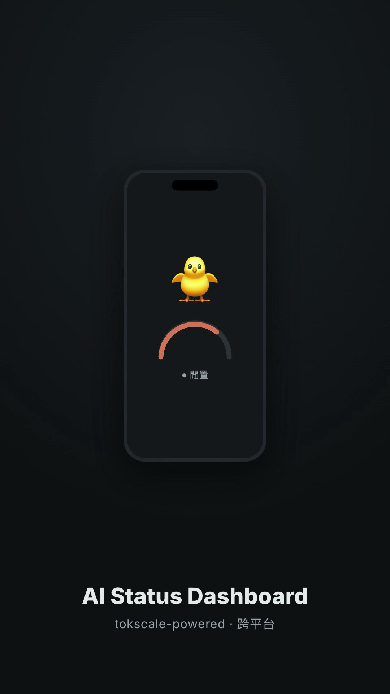

# AI Status Dashboard

> 把 **Claude Code** 與 **Codex** 的用量做成一頁本地 dashboard，讓桌上閒置的 iPhone 用 Safari 連區網當「常駐副螢幕」。附 [petdex](https://petdex.dev) 像素寵物：工作中會動、閒置會呼吸、額度用完會睡著。

[](https://github.com/s813082/ai-status-dashboard/blob/main/brag-output/brag.mp4)

- **零相依**：純 `node:http`，無 Express、無前端框架，唯一第三方是本地打包的 Chart.js。
- **多視圖單頁**：今日用量 / 報表 / 工具佔比 / 熱力圖 / 額度警示 / 設定，hash 路由切換。
- **兩速資料流**：額度與花費每 60s 更新，運作狀態走 ~5s 前端輪詢。
- **雙語**：繁體中文 / English 即時切換。
- **macOS 與 Windows 皆可常駐**：launchd 或工作排程，開機自動起。

---

## 快速開始

**需求**：Node.js ≥ 18、[tokscale](https://github.com/junhoyeo/tokscale) CLI、已在本機登入的 Claude Code／Codex。

```bash
npm install -g tokscale     # 若尚未安裝
tokscale codex import       # 讓 tokscale 讀得到 Codex 憑證（Claude 會自動讀本機登入狀態）
tokscale usage --json       # 驗證：應列出 Claude／Codex
```

接著一行啟動，macOS 與 Windows 指令相同：

```bash
npx github:s813082/ai-status-dashboard
```

終端會印出可用網址：

```
  AI Status Dashboard
    http://localhost:8787
    http://192.168.1.23:8787
  資料目錄：~/.ai-status-dashboard
```

**用 iPhone 開第二個（LAN）網址**，不要用 `localhost`——那會指向 iPhone 自己。iPhone 需與電腦連同一個 Wi-Fi。Safari「加入主畫面」可存成全螢幕 app。

> npx 直接執行時素材庫是空的（寵物 sprite 不隨 repo 散布，見[授權與素材聲明](#授權與素材聲明)）。寵物之後可在設定頁加，dashboard 本身功能完整。

想改程式或加寵物就改用 clone：

```bash
git clone https://github.com/s813082/ai-status-dashboard.git
cd ai-status-dashboard
npm start
```

---

## 開機自動常駐

跑完上面的快速開始、確認畫面正常後，再設定常駐。

**macOS（launchd）**——先編輯 `launchd/com.barry.ai-status-dashboard.plist`，把 `/Users/YOUR_USERNAME/...` 換成實際絕對路徑。**`PATH` 與 `TOKSCALE_BIN` 是最常見的坑**：launchd 的 PATH 不含 nvm/homebrew，而 tokscale 是 node 腳本，缺 node 於 PATH 會噴 `env: node: No such file or directory`。用 `dirname "$(command -v tokscale)"` 取得正確目錄填入：

```bash
cp launchd/com.barry.ai-status-dashboard.plist ~/Library/LaunchAgents/
launchctl bootstrap gui/$(id -u) ~/Library/LaunchAgents/com.barry.ai-status-dashboard.plist
launchctl list | grep ai-status-dashboard        # 應在清單內
```

**Windows（工作排程）**——需在 repo 目錄下，且目前網路設為「私人網路」。先預覽（不會安裝、不改 Firewall）：

```powershell
powershell.exe -NoProfile -ExecutionPolicy Bypass -File scripts\windows\setup.ps1 -WhatIf
```

確認後，以**系統管理員身分**開啟 PowerShell 執行：

```powershell
npm run setup:windows
```

腳本會驗證 Node 與 tokscale、建立登入時排程、建立限定 Private profile ＋ TCP 8787 ＋ 目前 `node.exe` 的 Firewall inbound rule，最後啟動服務並列出 iPhone URL。可安全重跑，同名項目會更新而不累積。若偵測到網路不是 Private，腳本會在修改 Firewall 前停止，不會自動放寬規則。

| 操作 | macOS | Windows |
| --- | --- | --- |
| 手動啟動 | `npm start` | `npm run start:windows` |
| 重啟服務 | `launchctl kickstart -k gui/$(id -u)/com.barry.ai-status-dashboard` | `Stop-ScheduledTask -TaskName 'AI Status Dashboard'`；再 `Start-ScheduledTask` |
| 停用／移除 | `launchctl bootout gui/$(id -u)/com.barry.ai-status-dashboard` | `Unregister-ScheduledTask -TaskName 'AI Status Dashboard' -Confirm:$false`；再 `Get-NetFirewallRule -DisplayName 'AI Status Dashboard' \| Remove-NetFirewallRule` |
| 看 log | `tail -f logs/err.log` | `Get-Content logs\dashboard.stderr.log -Tail 100` |
| 查 listener | `lsof -i :8787` | `Get-NetTCPConnection -State Listen -LocalPort 8787` |
| 查 LAN IP | `ipconfig getifaddr en0` | 啟動時終端會印出 |

> **改了 plist 的環境變數沒吃到**：`kickstart` 只重啟進程、不重讀 plist，需 `bootout` 後再 `bootstrap`。改 `index.html`／`i18n.js` 則完全不用重啟，每次 GET 即時讀檔。

---

## 它怎麼運作

```
tokscale usage --json ───┐
tokscale codex status ───┼─ 60s ─▶ collectors/tokscaleSnapshot.js ─▶ snapshot.json（記憶體 + 落地）
tokscale graph -c <t> ───┘                                                   │
~/.claude/projects/**/*.jsonl                                                ▼
~/.codex/sessions/**/*.jsonl  ── mtime ──▶ collectors/activity.js ─ 即時 ─▶ server.js (0.0.0.0:8787)
                                                                             │
tokscale monthly / models / graph ── on-demand（TTL 快取）──▶ /api/usage/*    ▼
                                        GET /api/status（5s 輪詢）◀── iPhone / 瀏覽器
```

本專案只負責「讀 tokscale → 正規化 → 判斷運作狀態 → 畫成頁面」，**不自己碰任何帳號 OAuth**——授權全由各 CLI 與 tokscale 負責，所以 dashboard 沒有登入頁。

- **額度／花費（60s）**：Claude 額度來自 `tokscale usage --json`、Codex 來自 `tokscale codex status --json`、花費由 `tokscale graph` 的 `summary.totalCost` 推算，正規化成 `providers.{claude,codex}` 的 `windows[]` 與 `cost`。
- **韌性**：整體失敗 → 沿用上一份快取並標 `stale`。tokscale 對某 provider 間歇性抓不到時（尤其 Claude）會重試數次，仍缺則 **carry-forward 沿用該 provider 上一份好資料**，避免額度環閃成空白。
- **運作狀態（即時）**：只看檔案 mtime，不掃 process。session log 在 60 秒內有寫入 → `working`；額度觸底 → `exhausted`；其餘 → `idle`。
- **報表（on-demand）**：加 60–120 秒 TTL 快取並串行化同 key 請求，避免報表頁高頻 spawn tokscale。

---

## 常見任務

### 切換視圖

打開頁面先看到 **Launcher 首頁**，點磚進入；左上 **← 選單** 回首頁。

| 視圖 | Hash | 內容 |
| --- | --- | --- |
| 今日用量 | `#/today` | 兩欄即時額度環 ＋ 寵物 ＋ 花費 |
| 用量報表 | `#/usage` | 期間下拉（本週／本月／自訂）→ 逐日、分工具的堆疊面積圖 |
| 工具佔比 | `#/pie` | 甜甜圈圖，可切「依工具」或「依模型」 |
| 使用熱力圖 | `#/heatmap` | GitHub 綠格風格的年度貢獻圖 |
| 額度警示 | `#/alerts` | 目前接近上限的額度清單 |
| 設定 | `#/settings` | 語言／主題／更新頻率／顯示工具／螢幕恆亮／預算與閾值／寵物 |

### 加入與切換寵物

**切換**：設定頁（`#/settings`）最下方，Claude／Codex 兩區各列出素材庫縮圖，點一下即換，選擇持久化。

**加進素材庫**——最快是從 petdex 圖庫補貨（需 clone，腳本為 bash，Windows 請用 Git Bash 或 WSL）：

```bash
npx petdex list              # 找 slug
npm run add-pet <slug>       # 自動 install 並複製進素材庫
```

或自己丟一組 `spritesheet.webp` ＋ `pet.json` 進 `src/public/pets/library/<你的名字>/`：

```json
{ "id": "<你的名字>", "displayName": "顯示名", "spritesheetPath": "spritesheet.webp" }
```

**素材格式**：spritesheet 為 8 欄 × 9 列、每格 192×208px（整張 1536×1872）；第 0 列 idle、第 2 列 working（petdex 標準佈局）。

### 額度環顯示「無資料」

代表 **tokscale 抓不到該 provider 的訂閱額度**——這是 tokscale／上游的授權或間歇性問題，修復點在 tokscale 端：

- **Codex 回 401／無資料**：重跑 `tokscale codex import`（前提是 Codex CLI 本機仍登入有效），再用 `tokscale codex status --json` 確認。
- **Claude 間歇性無資料**：dashboard 已內建重試 ＋ carry-forward，通常下一輪自動補回。長期抓不到就確認本機 Claude Code 仍登入。
- **全部都無資料**：確認 tokscale 在 PATH（`tokscale --version`）；launchd 下另外確認 plist 的 `TOKSCALE_BIN` 與 `PATH`。

### 讓 iPhone 螢幕恆亮

設定頁的「🔆 螢幕恆亮」開關控制（偏好持久化）。網頁本身無法阻止系統休眠，只有 Screen Wake Lock API 或影片播放能維持，皆不可行時請用系統設定：

| 情境 | 做法 |
| --- | --- |
| 舊 iPhone（iOS < 16.4）當專用副螢幕 | **設定 → 顯示與亮度 → 自動鎖定 → 永不**（最可靠，首選）|
| 較新 iPhone（Safari 16.4+） | 設定頁開關開著即可（全螢幕建議 iOS 18.4+）|
| 原生 API 不支援時的備援 | 頁面內建隱藏靜音循環影片，**點一下畫面**啟動，且需關閉低耗電模式 |
| Mac 當副螢幕 | 終端跑 `caffeinate -d` |

### 橫放當副螢幕

把 iPhone 橫放（例如 932×430 這種很寬很矮的可視區）時，「今日」卡片會**自動**調整，無需設定：高度 ≤ 520px 且寬度 ≥ 640px 時卡片由上下堆疊改為左右並排；極矮視窗才回退到整體等比縮小以確保底部花費不被裁切；旋轉裝置時自動把 pinch 縮放歸位。一般桌機與直向手機不受影響。

---

## 參考

### HTTP API

Server 監聽 `0.0.0.0:8787`，區網存取無需驗證（家用 LAN 假設）。報表端點永不回 500，統一回 `{ ok, data }`。

| Method | 路徑 | 說明 |
| --- | --- | --- |
| `GET` | `/` | Dashboard 頁面 |
| `GET` | `/api/status` | 最新快照 ＋ 即時 activity ＋ `petConfig`；永不 500，失敗回快取標 `stale`，冷啟動回 `loading` |
| `GET` | `/api/usage/daily?range=week\|month` | 逐日用量（含 `byClient` 逐工具花費）|
| `GET` | `/api/usage/monthly` | `tokscale monthly` 月報 |
| `GET` | `/api/usage/models` | 各 model／client 用量 |
| `GET` | `/api/usage/graph?range=year\|month` | 貢獻圖資料（`intensity` 0–4）|
| `GET` | `/api/usage/custom?since=&until=` | 自訂區間（`YYYY-MM-DD`）|
| `GET`／`POST` | `/api/settings` | 讀／寫 settings（部分更新合併）|
| `GET` | `/api/pets` | 素材庫寵物清單 |
| `GET` | `/api/config` | 目前每欄寵物選擇 |
| `POST` | `/api/select` | body `{ column, petId }`，不合法回 `400` |

`GET /api/status` 回應（節錄）：

```json
{
  "loading": false, "stale": false, "reachable": true,
  "tokscaleVersion": "4.0.8", "updatedAt": "2026-07-22T06:10:52.000Z",
  "petConfig": { "claude": "clawd", "codex": "boba" },
  "providers": {
    "claude": {
      "windows": [
        { "kind": "session", "usedPercent": 9,  "remainingPercent": 91, "resetAt": "..." },
        { "kind": "weekly",  "usedPercent": 36, "remainingPercent": 64, "resetAt": "..." }
      ],
      "cost": { "todayUSD": 38.80, "last30DaysUSD": 428.43 },
      "error": null, "activity": "working"
    }
  }
}
```

`activity` 值域：`idle` | `working` | `exhausted`。provider 若走 carry-forward 會帶 `staleWindows: true`。

### 額度環對映規則

每欄前端固定顯示 session／weekly 兩環，缺者顯「無資料」。

| Provider | tokscale label | → `kind` | 說明 |
| --- | --- | --- | --- |
| Claude | `Session` | `session` | 5 小時視窗 |
| Claude | `Weekly` | `weekly` | 週視窗 |
| Codex | `5h` | `weekly` | tokscale 標為 `5h`，但實測 `resets_at` 約 7 天後 → 屬週額度。Codex 無真正 5 小時視窗，session 環永遠「無資料」|

### 環境變數與資料位置

| 變數 | 預設 | 說明 |
| --- | --- | --- |
| `PORT` | `8787` | 監聽連接埠 |
| `HOST` | `0.0.0.0` | 綁 `0.0.0.0` 才連得到區網 |
| `TOKSCALE_BIN` | `tokscale` | tokscale 執行檔路徑；launchd 下必填絕對路徑 |
| `AISD_DATA_DIR` | 見下 | 覆寫執行期資料目錄 |

資料目錄解析順序為 `AISD_DATA_DIR` > 專案 clone 的 `data/` > `~/.ai-status-dashboard`。**npx 執行時一律走 home**，因為套件落在 npm 快取、寫在那裡的設定下次就沒了。目錄內含 `snapshot.json`（最新快照，重啟時墊底）、`pet-config.json`、`settings.json`：

```json
{
  "pollIntervalMs": 5000,
  "lang": "tw",
  "theme": "auto",
  "keepAwake": true,
  "providerVisibility": { "claude": true, "codex": true },
  "budgets": [
    { "provider": "claude", "budgetUSD": null, "thresholdPercent": 85 },
    { "provider": "codex",  "budgetUSD": null, "thresholdPercent": 85 }
  ]
}
```

### 專案結構

```
ai-status-dashboard/
├── bin/cli.js                    # npx 進入點（啟動 + 印出 LAN URL）
├── src/
│   ├── server.js                 # node:http 進入點；狀態／報表／設定／靜態路由
│   ├── providers.js              # provider 設定中心（新增 provider 只加一列）
│   ├── dataDir.js                # 執行期資料目錄解析
│   ├── collectors/
│   │   ├── tokscale.js             # CLI 低階封裝（execFile、Windows shim、版本偵測）
│   │   ├── tokscaleSnapshot.js     # 60s 額度／花費快照：重試 + carry-forward + 落地
│   │   ├── tokscaleReports.js      # 報表資料層（TTL 快取 + in-flight 串行化）
│   │   └── activity.js             # 純 mtime 的 working/idle/exhausted 判斷
│   └── public/                   # index.html（單頁多視圖）、i18n.js、vendor/、pets/library/
├── scripts/
│   ├── add-pet.sh                # npm run add-pet <slug>
│   └── windows/                  # setup.ps1、start-dashboard.ps1
└── launchd/                      # plist（需填 PATH / TOKSCALE_BIN / node 絕對路徑）
```

---

## 已知限制

- **完全依賴 tokscale**：未安裝或不在 PATH → 額度／花費／報表全「無資料」並顯 banner。
- **額度是間歇性資料**：tokscale 抓某 provider（尤其 Claude）時好時壞；已用重試 ＋ carry-forward 緩解，上游持續失敗時仍會顯「無資料」。
- **Codex 只有週額度環**：tokscale 對 Codex 僅回單一 metric，5 小時環永遠空著。
- **花費為本機推算**：來自掃本機 session log，換電腦看不到歷史；額度百分比則是帳號真相。畫面已標「本機推算」。
- **單機模式**：只反映這台電腦的狀態，不聚合其他裝置、不上傳雲端。
- **iPhone 收不到桌面通知**：走 LAN http（非安全來源）時 Notification API 不可用，降級為頁內橫幅。
- **運作狀態用 mtime**：無法區分「思考中」與「這輪剛結束」。
- **tokscale 授權會過期**：Codex token 過期會 401，重跑 `tokscale codex import`。

---

## Changelog

完整內容見 [CHANGELOG.md](CHANGELOG.md)。

| 版本 | 日期 | 重點 |
| --- | --- | --- |
| [0.7.1](CHANGELOG.md#071--2026-07-26) | 2026-07-26 | 修復 Windows 未設 `TOKSCALE_BIN` 時因 npm 只有 `.cmd` shim 而抓不到資料（自 0.6.0 起存在）|
| [0.7.0](CHANGELOG.md#070--2026-07-26) | 2026-07-26 | npx 一行啟動（`bin/cli.js` ＋ LAN URL 輸出）、資料目錄改由 `dataDir.js` 解析、README 重整與 Changelog 表格化 |
| [0.6.0](CHANGELOG.md#060--2026-07-26) | 2026-07-26 | Windows LAN 支援：setup／start PowerShell 腳本、登入時工作排程、Private-only Firewall rule、tokscale `.cmd`／`.bat` shim 相容 |
| [0.5.0](CHANGELOG.md#050--2026-07-23) | 2026-07-23 | 矮螢幕／橫向副螢幕自適應：卡片左右並排重排、等比縮放保底、轉向自動歸位 |
| [0.4.0](CHANGELOG.md#040--2026-07-22) | 2026-07-22 | Launcher 首頁與 hash 多視圖：用量報表、工具佔比、熱力圖、額度警示、設定頁、i18n、vendored Chart.js |
| [0.3.0](CHANGELOG.md#030--2026-07-22) | 2026-07-22 | 資料源由 CodexBar 改為跨平台的 tokscale CLI；新增額度重試與逐 provider carry-forward |
| [0.2.0](CHANGELOG.md#020--2026-07-21) | 2026-07-21 | 首次公開發布：網頁換寵物、一鍵補貨、螢幕恆亮、即時時鐘 |
| [0.1.0](CHANGELOG.md#010) | — | 初始版本：CodexBar collector、mtime 活動偵測、單頁 dashboard、launchd 常駐 |

---

## 授權與素材聲明

- 程式碼授權：<!-- 依你選擇填入，例如 MIT -->。
- **寵物素材（sprite）不隨本 repo 散布**：petdex 圖庫上的寵物為第三方投稿，可能涉及版權或肖像權，故 `src/public/pets/library/` 內的 `spritesheet.webp` 與衍生 icon 均以 `.gitignore` 排除。請自行透過 `npm run add-pet` 取得，或放入你有權使用的素材。
- 資料源 [tokscale](https://github.com/junhoyeo/tokscale) 與 [petdex](https://petdex.dev) 皆為各自作者所有。
